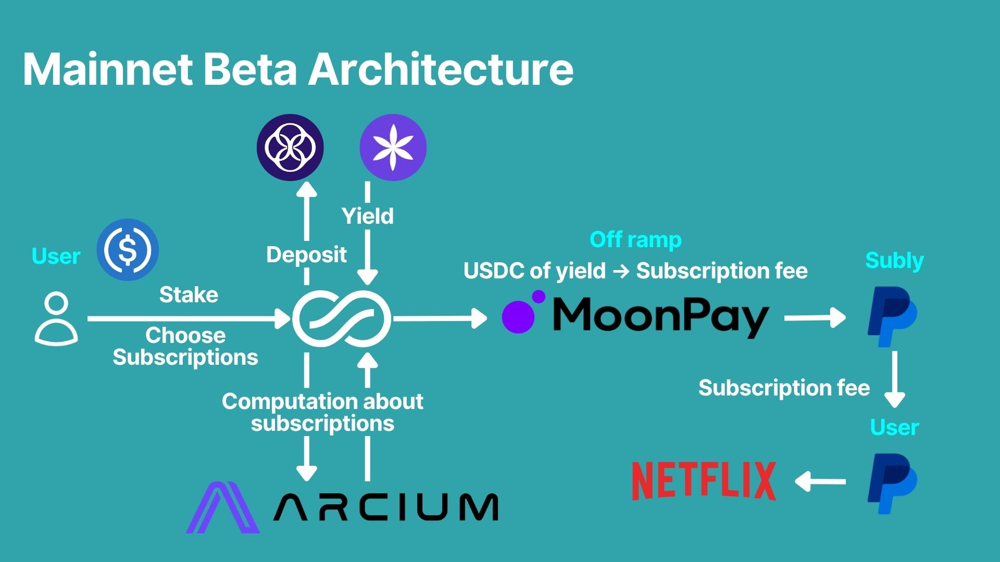

# Subly Demo Monorepo

## Overview

Subscribe Now, Pay Never. This is the privacy-first PayFi protocol for subscription services such as Netflix, Disney+ and Spotify - powered by Arcium, Perena and PayPal.

## Pitch

- Pitch video: https://www.loom.com/share/4d97e62695e74f938bb00de3b386a8a6
- Pitch deck: https://www.canva.com/design/DAG2-6ozMK0/ko3zrGwpvqAd41BW-BZqDg/view?utm_content=DAG2-6ozMK0&utm_campaign=designshare&utm_medium=link2&utm_source=uniquelinks&utlId=h62c3c8797a

## Technical Demo

- Pitch video: https://www.loom.com/share/7042c7535fba4969937e92df63da826d
- Pitch deck: https://www.canva.com/design/DAG3K45HaWk/mFLQjEB_8uEbITBq76nNFw/view?utm_content=DAG3K45HaWk&utm_campaign=designshare&utm_medium=link2&utm_source=uniquelinks&utlId=hcc13f9028a

## Demo site

- https://demo.sublyfi.com/

## Integration with Phantom Wallet Demo
- https://github.com/user-attachments/assets/38118338-c23e-4bf0-a0fc-01aa9d193970

## Key Features
### Solana program

- Deposit USDC program
- Subscribe subscription service program
- Register subscription service program
- Register PayPal account program

### Privacy

- Subscription service computation
- Encrypt subscription data

### Frontend

- Stake page
- Subscription page
- Profile page
- Privy connect wallet

### Offchain batch

- Send subscription fee from Subly PayPal account to User PayPal account

## Project Structure

```
├── README.md
├── MainnetArchitecture.jpg
├── .gitignore
├── subly-anchor         # Subly anchor demo app
│   ├── frontend         # Subly demo app frontend
│   ├── migrations
│   ├── patches
│   ├── programs         # Subly anchor program
│   ├── scripts          # Subly demo app offchain script
│   ├── tests            # Subly anchor test
│   ├── .env.example
│   ├── .prettierignore
│   ├── Anchor.toml
│   ├── Cargo.lock
│   ├── package.json
│   ├── readme.md
│   ├── tsconfig.json
│   └── yarn.lock
└── subly_privacy_layer  # Subly demo app arcis framework
    ├── app              # Subly frontend for arcis framework
    ├── encrypted-ixs    # Private computation program
    ├── migrations
    ├── programs         # Solana program
    ├── scripts          # Subly demo app offchain script
    ├── tests            # Subly arcis test
    ├── .gitignore
    ├── .prettierignore
    ├── Anchor.toml
    ├── Arcium.toml
    ├── Cargo.lock
    ├── Cargo.toml
    ├── package.json
    ├── readme.md
    ├── tsconfig.json
    └── yarn.lock
```

## Landing Page

### Landing Page URL

- https://www.sublyfi.com/

### Landing Page Repository

- https://github.com/SublyFi/subly-lp

## Mainnet Beta Architecture



## Technology Stack

### Frontend/Backend

- Next.js
- Tailwindcss

### Solana framework

- Arcis
